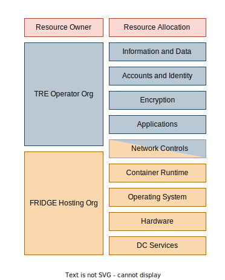

# Governance Extension for FRIDGE

**FRIDGE: Federated Research Infrastructure by Data Governance Extension**

Artificial Intelligence (AI) models can help enhance research to solve complex problems in society, but this requires access to sensitive data on large-scale, shared AI supercomputers, like the UK’s AI Research Resource (AIRR). FRIDGE will leverage the compute capacity provided by AI supercomputers by extending the security management system from a primary of "Front Door" TRE onto these facilities.

## 1. Purpose

Using sensitive data to develop AI models involves carefully isolating parts of large AI supercomputers as Trusted Research Environments (TREs) so that only approved researchers can safely access them for their research. FRIDGE aims to explore this possibility by creating a ready-to-use TRE that meets the [SATRE specification](https://satre-specification.readthedocs.io/en/stable/) (developed as part of the DARE UK Phase 1 Driver Projects and enhanced by TREvolution) on the AIRR. This will enable the secure use of sensitive data to develop AI models for research that benefits the public while ensuring strict information governance.

This document sets out the high-level architecture for this extended governance in order to clearly distinguish between areas of responsibilities and provide a framework for the federated computation delivered by FRIDGE.

## 2. FRIDGE Architecture

The above view shows the highest-level architecture for FRIDGE consisting of:

- A front door TRE where the researcher operates. There is an interface TRE software for analysis and research data. The front door TRE will provide the capabilities and contain components found in the [SATRE Architecture](https://satre-specification.readthedocs.io/en/stable/architecture.html).
- A FRIDGE TRE where large scale AI compute is available. Within the FRIDGE TRE there is a job processor, super computing hardware (AI) and an analysis-ready copy of the research data.

The researcher works within the front door TRE and, if they have the job submitter role, can send jobs to and receives results from the FRIDGE TRE. 

## 2. Roles

Roles Catalogue

|Key | Role | Source / Definition | Specialisation|
|-----|------|---------|--------------|
|R01 | TRE Operator Organisation | The lead organisation providing the TRE all Infrastructure Management and Governance defined in [SATRE](https://satre-specification.readthedocs.io/en/latest/roles.html#project-roles) sit within this org.| Operates Front Door TRE and FRIDGE TRE, manages technical security controls, may receive delegated approval authority from Data Provider |
|R02 | FRIDGE Hosting Organisation | The organisation which provides the platform on which the FRIDGE TRE is hosted | Provisions and secures resources on FRIDGE hosting facility (AIRR infrastructure). Specialisations: * **Public Cloud** hosting org. (E.G. AWS, GCP, Azure) * **Private Cloud** provided by the TRE Operator Org. * **National Facility** (E.G. [AIRR](https://www.ukri.org/news/300-million-to-launch-first-phase-of-new-ai-research-resource/)) |
|R03 | Information Asset Owner (synonymous with Data Provider) | [SATRE](https://satre-specification.readthedocs.io/en/stable/roles.html#data-management-roles)| Responsible for data governance and approving data access requests |
|R04 | Resource Allocator (Resource Owner) | FRIDGE Safe Project Process | Approves compute resource requests, ensures projects align with AIRR objectives, monitors resource utilisation |
|R05 | Top Management | [SATRE](https://satre-specification.readthedocs.io/en/stable/roles.html#governance-roles) | Within the scope of FRIDGE this role the "Organisation" covered by top management includes the extended governance boundary |
|R06 | Operational Management Group | [Governing FRIDGE](Governing_FRIDGE.md#22-operational-management-group) | Representatives from all four key organisations (Resource Allocator, FRIDGE Hosting Organisation, TRE Operator Organisation, Data Provider). Coordinates day-to-day operations, addresses cross-organisational issues, and escalates strategic issues to Top Management |
|R07 | Principal Investigator (PI) | FRIDGE Safe Project Process | Leads research projects, submits Safe project applications, nominates researchers |
|R08 | Data Consumer (synonymous with Researcher)| [SATRE](https://satre-specification.readthedocs.io/en/latest/roles.html#project-roles)| NA |
|R09 | Safe Researcher | FRIDGE Safe Researcher Process | Researcher who has completed training, signed attestation, and been approved for data access |
|R10 | Job Submitter | [DARE UK Federated Blueprint](https://zenodo.org/records/14192786)| Within the scope of the FRIDGE architecture this role requires the data consumer role |

## 2. Boundaries

The figure below shows the external boundaries for the extended governance of FRIDGE and the internal boundaries between component parts of the system.

### 2.1 Governance Boundary

**Top Management is accountable for the governance boundary**. The governance boundary denotes the scope of risk and control across the entire system. This boundary may be synonymous with an ISO 27001 scope or similar and commonly an extension of an existing scope defined by the Front Door TRE Hosting organisation. The extension of an existing scope is likely to require [changes to the information governance framework](./Governing_FRIDGE.md#4-governance-framework).

**Established by:** [Safe setting Process](FRIDGE_Safe_Setting_Process.md#step-5-final-approval) when the agreement is formed between organisations on the secure hosting of the FRIDGE TRE.

### 2.2 Front Door TRE Hosting Boundary

**The hosting organisation (Public or Private Cloud) is accountable for the Front Door TRE Hosting Boundary**. The TRE hosting boundary ensures the security of the underlying cloud platform hosting the TRE. The hosting org is therefore responsible for protecting the infrastructure that runs all of the cloud services. This infrastructure is composed of the hardware, software, networking, and facilities. See [AWS](https://aws.amazon.com/compliance/shared-responsibility-model/), [Azure](https://learn.microsoft.com/en-us/azure/security/fundamentals/shared-responsibility), [GCP](https://cloud.google.com/architecture/framework/security/shared-responsibility-shared-fate) for public cloud. UCL's TRE on private cloud supports a similar [shared responsibility model](https://isms.arc.ucl.ac.uk/rism02-roles_and_responsibilities/#6shared-responsibility-model) with the private cloud being part of the "UCL supporting Services".

### 2.3 Front Door TRE Boundary

**The TRE Operator Organisation is accountable for the Front Door TRE Boundary**. The Front Door TRE boundary ensures the security of the TRE. The boundary is made up of technical controls for capabilities such as [Infrastructure Management](https://satre-specification.readthedocs.io/en/stable/pillars/computing_technology.html#infrastructure-management) and process controls for [study management](https://satre-specification.readthedocs.io/en/stable/pillars/information_governance.html#study-management).

### 2.4 TRE Project Boundary

**The Project boundary responsibility is shared between the TRE operator organisation and the Information Asset Owner**. Applicable technical controls as documented in the [Computing Technology and Information Security pillar](https://satre-specification.readthedocs.io/en/stable/pillars/computing_technology.html#computing-technology-and-information-security) of SATRE are the responsibility of the TRE operator organisation. Controls within the Information Governance pillar of SATRE will largely be the responsibility of the Information Asset Owner. There may be explicit agreements in place to transfer these responsibilities from the Information Asset Owner to the TRE Operator where the operator is providing a managed service.

The degree to which these controls are delegated down to research teams themselves will be dependant on the ["TRE Archetype"](https://github.com/sa-tre/satre-high-level-design/blob/7039de11b11ca3e9ad07f10e683d9c3f037e2ebe/Docs/designs/TRE_Architypes.md). [Data provider archetypes](https://github.com/sa-tre/satre-high-level-design/blob/7039de11b11ca3e9ad07f10e683d9c3f037e2ebe/Docs/designs/TRE_Architypes.md#21-data-provider-archetype) will take a much greater role in ensuring the security of the project boundary as they are the TRE platform and data provider. [Bring your own data archetype](https://github.com/sa-tre/satre-high-level-design/blob/7039de11b11ca3e9ad07f10e683d9c3f037e2ebe/Docs/designs/TRE_Architypes.md#22-bring-your-own-data-archetype) operators delegate the security fo the project down to the the project team (usually a primary investigator).

**Established by:** [Safe Project Process - Step 2.1](FRIDGE_SAFE_Project_Process.md#step-21-front-door-tre-access-provisioning) when Front Door TRE project workspace is provisioned and TRE Project Boundary is established.

### 2.5 FRIDGE TRE Hosting Boundary

**The FRIDGE TRE Hosting Boundary responsibility is the responsibility of the FRIDGE TRE hosting organisation**. The FRIDGE TRE hosting boundary ensures the security of the underlying cloud platform hosting. The hosting org is therefore responsible for protecting the infrastructure that runs all of the cloud services. This infrastructure is composed of the hardware, software, networking, and facilities. The configuration of the hosting platform in line with "normal" operation with no adaptations for hosting a TRE. Any additional controls are applied to the FRIDGE TRE Boundary below.

### 2.6 FRIDGE TRE Boundary

**The FRIDGE TRE boundary responsibility is shared between the TRE operator and the FRIDGE Hosting Organisation.** 

Only part of the hosting organisation is within the governance boundary and therefore the TRE(s) inherit residual risk from the hosting organisation. Where there are shared components additional controls must be applied by the TRE operator organisation. For example encryption network policies managed by the hosting organisation to segregate the TRE from the rest of the platform.

Information and data, accounts and identity, encryption and applications are the responsibility of the TRE organisation with network controls and resource allocation shared between the TRE operator, the FRIDGE hosting organisation and the resource allocator.

The TRE operator is responsible for defining the requirements for resource allocation and network controls and the FRIDGE hosting organisation is responsible for ensuring the correct implementation. An agreed processes must be established and quality data be created and maintained to ensure manual and automated changes are correctly implemented.

**Established by:** [Safe Project Process - Step 2.2](FRIDGE_SAFE_Project_Process.md#step-22-fridge-hosting-resource-provisioning) when FRIDGE TRE is deployed on allocated resources and FRIDGE TRE Boundary is established. 

### 2.7 Code Repository Boundary

<!--Need to add-->

### 2.8 Private Network Boundary

<!--Need to add-->

