# FRIDGE Standardised Safe Project Process

**Version:** 1.0  
**Target Infrastructure:** UK AIRR (Dawn, Isambard-AI)  
**Compliance:** SATRE Specification, NHS DSP Toolkit  
**Frequency:** Once per project  
**Target Duration:** 1 week  
**Prerequisites:** [Safe Setting Process](FRIDGE_Safe_Setting_Process.md) complete - TRE Operator must have Safe Setting approval

## 1. Overview

This document defines the standardised process for establishing and operating Safe projects within the FRIDGE infrastructure. The process coordinates four key organisations to ensure secure, compliant access to sensitive data on AI supercomputing resources.

**Note:** Before a Safe project can be initiated, the TRE Operator must have completed the [Safe Setting Process](FRIDGE_Safe_Setting_Process.md) and received Safe Setting approval to host TREs on the FRIDGE platform.

## 2. Process Flow Diagram

```mermaid
graph TD
    Start([PI Initiates Project]) --> Submit[1.1: PI Submits Application<br/>to Data Provider]
    
    Submit --> ParallelStart{Metadata Triggers<br/>Parallel Reviews}
    
    ParallelStart --> DataReview[1.2A: Data Provider Review<br/>- Assess data access request<br/>- Verify legal basis<br/>- Check ethics approvals]
    ParallelStart --> ResourceReview[1.2B: Resource Allocator Review<br/>- Review compute requirements<br/>- Check AIRR alignment<br/>- Assess resource availability]
    
    DataReview --> DataDecision{Data Provider<br/>Approval?}
    ResourceReview --> ResourceDecision{Resource<br/>Approval?}
    
    DataDecision -->|Reject| End1([Project Rejected])
    ResourceDecision -->|Reject| End1
    
    DataDecision -->|Approve| PrepareAgreement[Prepare Data Access<br/>Agreement/Attestation]
    ResourceDecision -->|Approve| ReserveResources[Reserve Compute<br/>Resources]
    
    PrepareAgreement --> BothApproved{Both<br/>Approvals?}
    ReserveResources --> BothApproved
    
    BothApproved -->|No| End1
    BothApproved -->|Yes| SignAgreement[1.3: PI Signs Agreement]
    
    SignAgreement --> VerifySign[Data Provider Verifies<br/>Signed Agreement]
    VerifySign --> TriggerProv[Trigger Provisioning Process]
    
    TriggerProv --> ProvisionFrontDoor[2.1: Front Door TRE Provisioning<br/>- Create TRE workspace<br/>- Setup job submission interface<br/>- Connect to FRIDGE platform]
    
    ProvisionFrontDoor --> ProvisionFRIDGE[2.2: FRIDGE Hosting Platform Provisioning<br/>- Allocate compute on AIRR<br/>- Create project space<br/>- Transfer data<br/>- Configure security]
    
    ProvisionFrontDoor --> ProjectReady[Project Environment Ready]
    
    ProjectReady -.->|Separate Process| OnboardingProcess[Researcher Onboarding Process<br/>See Section 8]
    
    OnboardingProcess -.-> AccessGranted[Researcher Access Granted<br/>via Front Door TRE]
    
    AccessGranted --> Research[3.1: Ongoing Research<br/>- Analysis in Front Door TRE<br/>- Job submission to FRIDGE<br/>- Output review requests]
    
    Research --> OutputReview[3.2: Output Review<br/>- TRE Operator security check<br/>- Data Provider disclosure review]
    
    OutputReview --> OutputDecision{Output<br/>Approved?}
    OutputDecision -->|No| Research
    OutputDecision -->|Yes| ReleaseOutput[Release Output to PI]
    
    ReleaseOutput --> ContinueResearch{Continue<br/>Research?}
    ContinueResearch -->|Yes| Research
    ContinueResearch -->|No| ProjectComplete[4.1: Project Completion<br/>- Final audits<br/>- Archive documentation]
    
    ProjectComplete --> Decommission[4.2: Environment Decommissioning<br/>- Revoke access<br/>- Delete data<br/>- Release resources]
    
    Decommission --> End2([Project Closed])
    
    style ParallelStart fill:#ffeb99
    style BothApproved fill:#ffeb99
    style DataReview fill:#cce5ff
    style ResourceReview fill:#cce5ff
    style ProvisionFRIDGE fill:#d4edda
    style ProvisionFrontDoor fill:#d4edda
    style AccessGranted fill:#90EE90
```

**Diagram Legend:**
- **Yellow boxes**: Decision/coordination points
- **Light blue boxes**: Parallel review processes
- **Light green boxes**: Provisioning activities
- **Bright green box**: Access granted milestone
- **Dotted lines**: Separate process (not part of main Safe project flow)

---

## 3. Key Organisations and Roles

See [FRIDGE Governance Architecture - Roles Catalogue](FRIDGE_Governance_Extension_Architecture.md#2-roles) for detailed role definitions.

### 3.1 [Resource Allocator (Resource Owner)](FRIDGE_Governance_Extension_Architecture.md#2-roles)
- **Primary Responsibility:** Resource allocation and strategic alignment
- **Key Activities:** 
  - Approve compute resource requests
  - Ensure projects align with AIRR objectives
  - Monitor resource utilisation
  - Manage allocation lifecycle

### 3.2 [TRE Operator Organisation](FRIDGE_Governance_Extension_Architecture.md#2-roles)
- **Primary Responsibility:** Infrastructure management and technical governance
- **Key Activities:**
  - Operate Front Door TRE and FRIDGE TRE
  - Implement technical security controls
  - Manage infrastructure and network controls
  - Provide study management processes
  - Maintain SATRE compliance
- **Accountable for:** [Front Door TRE Boundary](FRIDGE_Governance_Extension_Architecture.md#23-front-door-tre-boundary), [FRIDGE TRE Boundary](FRIDGE_Governance_Extension_Architecture.md#26-fridge-tre-boundary) (shared)

### 3.3 [Data Provider (Information Asset Owner)](FRIDGE_Governance_Extension_Architecture.md#2-roles)
- **Primary Responsibility:** Data governance and information asset management
- **Key Activities:**
  - Define data access requirements
  - Approve data access requests
  - Ensure data handling compliance
  - Manage data lifecycle and retention
- **Accountable for:** [TRE Project Boundary](FRIDGE_Governance_Extension_Architecture.md#24-tre-project-boundary) (shared)

### 3.4 [FRIDGE Hosting Organisation](FRIDGE_Governance_Extension_Architecture.md#2-roles)
- **Primary Responsibility:** Provisioning and securing of resources on FRIDGE hosting facility
- **Key Activities:**
  - Provision compute resources on AIRR infrastructure (Dawn, Isambard-AI)
  - Establish network isolation and security controls (shared responsibility with TRE operator)
  - Monitor physical infrastructure security and performance
- **Accountable for:** [FRIDGE TRE Hosting Boundary](FRIDGE_Governance_Extension_Architecture.md#25-fridge-tre-hosting-boundary), [FRIDGE TRE Boundary](FRIDGE_Governance_Extension_Architecture.md#26-fridge-tre-boundary) (shared)

## 4. Safe Project Lifecycle Process

### Phase 1: Project Initiation

#### Step 1.1: Application Submission
**Lead:** Principal Investigator (PI)  
**Involves:** Data Provider

**Actions:**
1. Principal Investigator submits Safe project application to Data Provider including:
   - Research objectives and public benefit
   - Data requirements and justification
   - Team composition and roles
   - Ethical approvals and governance documentation
   - Compute resource estimates (for information)

**Outputs:**
- Safe project application
- Supporting documentation (ethics approvals, institutional backing)

---

#### Step 1.2: Parallel Review Processes
**Lead:** Data Provider (primary) and Resource Allocator (parallel)  
**Involves:** PI

**Actions:**

**Process A: Data Provider Review (Primary Path)**
- Assess data access request against information governance policies
- Verify legal basis for data processing
- Confirm ethical approvals are in place
- Verify PI credentials and institutional backing
- Confirm TRE Operator as a "safe setting" provider
- Decision: Approve/Reject/Request modifications

**Process B: Resource Allocation Review (Parallel Path)**
- Project metadata automatically passed to Resource Allocator
- Resource Allocator reviews:
  - Compute resource requirements
  - Strategic alignment with AIRR objectives
  - Resource availability on FRIDGE hosting facility
  - Project feasibility on target infrastructure (Dawn/Isambard-AI)
- Decision: Approve/Reject resource allocation

**If Data Provider Approves:**
- Prepare Data Access Agreement or Attestation document
- Define data handling requirements and restrictions
- Specify output review procedures

**If Resource Allocator Approves:**
- Reserve compute resources on FRIDGE hosting facility
- Prepare resource allocation parameters

**Outputs:**
- Data Provider approval decision
- Resource Allocator approval decision
- Data Access Agreement/Attestation document (if approved)
- Resource allocation reservation (if approved)
- Data handling requirements

**Note:** Both approvals required to proceed to Step 1.3

---

#### Step 1.3: Agreement Signing and Access Grant
**Lead:** Principal Investigator  
**Involves:** Data Provider

**Actions:**

1. **Principal Investigator:**
   - Reviews Data Access Agreement/Attestation
   - Signs agreement accepting terms and conditions
   - Returns signed agreement to Data Provider

2. **Data Provider:**
   - Verifies signed agreement
   - Confirms both data access and resource allocation approvals received
   - Triggers provisioning process

**Outputs:**
- Agreed Governance Boundary Established
- Signed Data Access Agreement/Attestation
- Authorisation to proceed with provisioning

---

### Phase 2: Project Setup and Provisioning

#### Step 2.1: Front Door TRE Access Provisioning
**Lead:** TRE Operator Organisation  
**Involves:** Data Provider

**Actions:**

1. **TRE Operator Organisation:**
   - Provision Front Door TRE project workspace
   - Set up job submission interface to FRIDGE hosting platform
   - Establish secure connection to FRIDGE project space

2. **Data Provider:**
   - Audit against requirements as necessary

**Outputs:**
- TRE Project Boundary established
- Operational Front Door TRE project environment
- Secure connection to FRIDGE hosting platform established
- Project ready for researcher access

**Note:** PI access to data is only granted after completing the separate Researcher Onboarding process (see Appendix E)

---

#### Step 2.2: FRIDGE Hosting Resource Provisioning
**Lead:** FRIDGE Hosting Organisation  
**Involves:** TRE Operator Organisation, Resource Allocator, Data Provider

**Actions:**

1. **FRIDGE Hosting Organisation:**
   - Provision approved compute resources on AIRR infrastructure (Dawn/Isambard-AI)
   - Configure resource quotas and scheduling policies
   - Establish network isolation and security controls
   - Implement physical / logical resource separation

2. **TRE Operator Organisation:**
   - Deploy FRIDGE instance on allocated and isolated resource
   - Configure additional security controls and isolation
   - Establish network connectivity to Front Door TRE

3. **Data Provider:**
   - Prepare analysis-ready data copy
   - Transfer data to FRIDGE and/or Front Door TRE project space (via secure channel)

**Outputs:**
- FRIDGE TRE Boundary established
- Allocated compute resources on FRIDGE hosting facility
- Project space created with data ingested
- Network connectivity established
- Security controls configured

---

### Phase 3: Project Operation

#### Step 3.1: Ongoing Research Activities
**Lead:** Researcher (Data Consumer)  
**Monitored by:** All four organisations

**Actions:**
1. **Researcher:**
   - Conduct analysis within Front Door TRE
   - Submit jobs to FRIDGE TRE (if Job Submitter)
   - Request output review for data egress

2. **TRE Operator (Continuous):**
   - Monitor TRE security and compliance
   - Manage infrastructure and capacity
   - Maintain audit logs

5. **FRIDGE Hosting Organisation (Continuous):**
   - Monitor infrastructure security and performance

**Outputs:**
- Research outputs (subject to review)
- Audit logs and compliance reports
- Resource utilisation reports

---

#### Step 3.2: Output Review and Approval
**Lead:** Data Provider  
**Involves:** TRE Operator Organisation

**Actions:**
1. **Researcher:**
   - Submit output egress request with justification

2. **TRE Operator:**
   - Output review

**Outputs:**
- Approved outputs released to researcher
- Output review audit trail

---

### Phase 4: Project Closure

#### Step 4.1: Project Completion
**Lead:** TRE Operator Organisation  
**Involves:** Data Provider, Resource Allocator

**Actions:**
1. **Researcher:**
   - Submit (or recieve) project completion notification
   - Request final output reviews

2. **TRE Operator:**
   - Archive project logs and documentation
   - Prepare decommissioning plan

3. **Resource Allocator:**
   - Review final resource utilisation
   - Close resource allocation

**Outputs:**
- Project closure report
- Project archive or deletion records
- Final audit documentation

---

#### Step 4.2: Environment Decommissioning
**Lead:** TRE Operator Organisation  
**Involves:** Data Provider

**Actions:**
1. **TRE Operator:**
   - Revoke researcher access
   - Decommission Front Door TRE project workspace
   - Release FRIDGE TRE compute allocation

2. **Data Provider:**
   - Execute data disposal according to retention policy
   - Verify secure data deletion

**Outputs:**
- Decommissioning completion certificate
- Data disposal certificate

---
