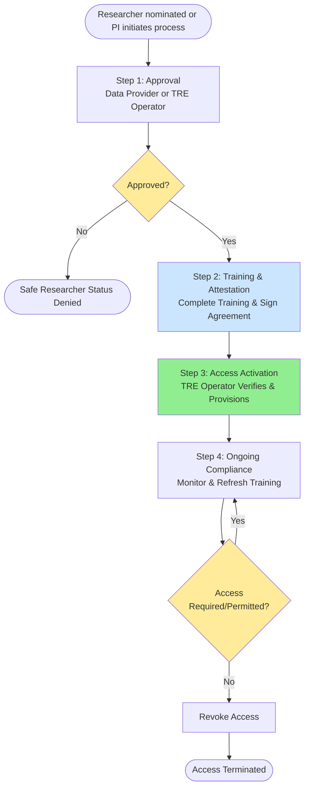

# FRIDGE Safe Researcher Process

**Version:** 1.0  
**Target Infrastructure:** UK AIRR (Dawn, Isambard-AI)  
**Compliance:** SATRE Specification, NHS DSP Toolkit  
**Target Duration:** 48 hours
**Frequency:** Once per researcher

## 1. Overview

This document defines the process for approving and onboarding Safe researchers within the FRIDGE infrastructure. Safe researchers must complete attestation and training requirements before accessing sensitive data within a TRE.

## 2. Process Flow Diagram

---

## 3. Key Organisations and Roles

See [FRIDGE Governance Architecture - Roles Catalogue](FRIDGE_Governance_Extension_Architecture.md#2-roles) for detailed role definitions.

### 2.1 [Data Provider (Information Asset Owner)](FRIDGE_Governance_Extension_Architecture.md#2-roles)
- Define Safe Researcher requirements and responsibilities
- Approve researcher access to sensitive data (May delegate approval responsibility to TRE Operator)

### 2.2 [TRE Operator Organisation](FRIDGE_Governance_Extension_Architecture.md#2-roles)
- Verify approvals are in place
- Provision accounts and authentication credentials
- May receive delegated approval authority from Data Provider

### 2.3 [Researcher (Data Consumer / Safe Researcher)](FRIDGE_Governance_Extension_Architecture.md#2-roles)
- Complete required training and attestation
- Maintain ongoing compliance

## 4. Safe Researcher Process

### Step 1: Researcher Approval
**Lead:** Data Provider (or delegated to TRE Operator)

**Actions:**
- PI nominates researcher for project or starts an application themselves
- Data Provider (or TRE Operator) reviews:
  - Institutional backing
- Decision: Approve/Reject

**Outputs:**
- Authorisation to proceed with application

---

### Step 2: Training and Attestation
**Lead:** Data Provider (or delegated training provider)

**Actions:**
- Researcher completes Safe researcher training:
- Pass training assessment
- Sign attestation accepting data handling responsibilities

**Outputs:**
- Training completion certificate
- Signed attestation

---

### Step 3: Access Activation
**Lead:** TRE Operator Organisation

**Actions:**
- Verify approvals (researcher approval, training, attestation)
- Create researcher account
- Assign roles (Data Consumer, Job Submitter etc.)
- Generate authentication credentials
- Enable access to TRE and project data

**Outputs:**
- Active account with authentication credentials
- Access to Front Door TRE and data

---

### Step 4: Ongoing Compliance
**Lead:** Data Provider and TRE Operator Organisation

**Actions:**
- **TRE Operator:** Monitor Safe researcher status (training up-to-date, still associated with sponsor org etc.)

**Outputs:**
- Updated training and association records
- Access revocation (when applicable)

---

## 5. Delegation of Approval Authority

The Data Provider may delegate researcher approval to the TRE Operator Organisation. Delegation must be:

- **Formalised:** Documented in delegation agreement
- **Conditional:** TRE Operator demonstrates appropriate governance
- **Monitored:** Regular audits and reporting to Data Provider

Data Provider retains ultimate accountability.

---

## 6. Key Requirements

- **Approval:** Data Provider approval (or delegated) required
- **Training:** Mandatory completion before access
- **Attestation:** Signed agreement required
- **Verification:** TRE Operator verifies all approvals before provisioning
- **Authentication:** TRE Operator provides credentials
- **Refresher:** Training renewal
- **Monitoring:** Continuous compliance tracking

