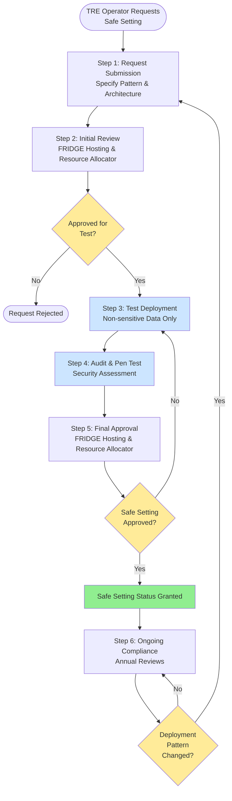

# FRIDGE Safe Setting Process

**Version:** 1.0  
**Target Infrastructure:** UK AIRR (Dawn, Isambard-AI)  
**Compliance:** SATRE Specification, NHS DSP Toolkit  
**Frequency:** Once per TRE Operator (or when deployment pattern changes)

## 1. Overview

This document defines the process for approving a TRE Operator to host a TRE on the FRIDGE hosting platform as a "Safe Setting". This process ensures that the TRE deployment meets security and compliance requirements before being approved for use with sensitive data.

**Note:** This process only needs to be completed once when a TRE Operator first uses FRIDGE, or if they change their deployment pattern.

## 2. Process Flow Diagram

---

## 3. Key Organisations and Roles

See [FRIDGE Governance Architecture - Roles Catalogue](FRIDGE_Governance_Extension_Architecture.md#2-roles) for detailed role definitions.

### 2.1 [TRE Operator Organisation](FRIDGE_Governance_Extension_Architecture.md#2-roles)
- Submit Safe Setting request
- Specify deployment pattern
- Deploy test environment
- Address audit findings during assessment
- **Establishes:** [Front Door TRE Boundary](FRIDGE_Governance_Extension_Architecture.md#23-front-door-tre-boundary) upon approval

### 2.2 [FRIDGE Hosting Organisation](FRIDGE_Governance_Extension_Architecture.md#2-roles)
- Review deployment pattern feasibility
- Support test deployment
- Approve Safe Setting status
- **Accountable for:** [FRIDGE TRE Hosting Boundary](FRIDGE_Governance_Extension_Architecture.md#25-fridge-tre-hosting-boundary)

### 2.3 [Resource Allocator](FRIDGE_Governance_Extension_Architecture.md#2-roles)
- Review resource requirements
- Approve Safe Setting status
- Allocate resources for test deployment

## 4. Deployment Patterns

### Pattern 1: FRIDGE Remote Job Submission TRE
- Front Door TRE with remote job submission to FRIDGE compute
- Data may resides in Front Door TRE and FRIDGE
- Jobs executed on FRIDGE TRE

### Pattern 2: Full Stack TRE
- Complete TRE deployed on FRIDGE hosting platform
- All components (workspace, airlock etc.) on FRIDGE
- Direct researcher access to FRIDGE-hosted environment

## 5. Safe Setting Process (6 Steps)

### Step 1: Request Submission
**Lead:** TRE Operator Organisation

**Actions:**
- TRE Operator submits Safe Setting request including:
  - Deployment pattern (Remote Job Submission or Full Stack)
  - Technical architecture documentation
  - Security control requirements for isolation
  - Resource requirements estimate

**Outputs:**
- Safe Setting request
- Technical documentation package

---

### Step 2: Initial Review and Approval
**Lead:** FRIDGE Hosting Organisation and Resource Allocator

**Actions:**

**FRIDGE Hosting Organisation:**
- Review deployment pattern feasibility
- Assess technical architecture
- Evaluate security controls
- Confirm compatibility with FRIDGE hosting platform

**Resource Allocator:**
- Review resource requirements
- Assess strategic alignment with AIRR objectives
- Evaluate cost implications

**Decision:** Approve for test deployment / Reject / Request modifications

**Outputs:**
- Initial approval decision
- Authorisation for test deployment
- Test resource allocation

---

### Step 3: Test Deployment
**Lead:** TRE Operator Organisation

**Actions:**
- TRE Operator deploys test environment on FRIDGE platform
- Use non-sensitive test data only
- Configure all security controls
- Implement monitoring and logging
- Document deployment process

**FRIDGE Hosting Organisation:**
- Provide test resource allocation
- Support deployment activities
- Verify isolation and security controls

**Outputs:**
- Operational test TRE environment
- Deployment documentation
- Test data ingestion confirmation

---

### Step 4: Audit and Penetration Testing
**Lead:** Independent auditor / Security team

**Actions:**
- Conduct security audit of test deployment:
  - Review security controls implementation
  - Verify compliance with SATRE specification

- Conduct penetration testing:
  - Test network isolation
  - Attempt unauthorised access
  - Evaluate vulnerability to common attacks
  - Test data exfiltration controls

- TRE Operator addresses findings during audit process

**Outputs:**
- Audit report with findings
- Penetration test report
- Remediation confirmation

---

### Step 5: Final Approval
**Lead:** FRIDGE Hosting Organisation and Resource Allocator

**Actions:**

**FRIDGE Hosting Organisation:**
- Confirm deployment meets platform requirements
- Decision: Approve Safe Setting status / Request additional remediation

**Resource Allocator:**
- Review final assessment
- Confirm alignment with AIRR objectives
- Decision: Approve Safe Setting status / Request additional remediation

**Both approvals required for Safe Setting status**

**Outputs:**
- Safe Setting approval
- Authorisation to deploy with sensitive data
- Approved deployment pattern documentation

---

### Step 6: Ongoing Compliance
**Lead:** TRE Operator Organisation

**Actions:**
- Maintain Safe Setting status through:
  - Annual security reviews
  - Incident reporting and management
  - Compliance with FRIDGE platform changes

**Note:** Changes to deployment pattern require repeating this process

**Outputs:**
- Annual compliance reports
- Incident reports (if applicable)
- Updated security documentation

---

## 5. Process Flow Diagram

---

## 6. Key Requirements

- **Deployment Pattern:** Must specify Remote Job Submission or Full Stack TRE
- **Test Deployment:** Required with non-sensitive data before approval
- **Security Audit:** Independent audit of security controls
- **Penetration Testing:** Required to verify isolation and security
- **Dual Approval:** Both FRIDGE Hosting Organisation and Resource Allocator must approve
- **Findings Resolution:** All critical findings must be addressed during audit
- **One-Time Process:** Only required once per TRE Operator (or pattern change)
- **Ongoing Compliance:** Annual reviews to maintain Safe Setting status

---

## 7. Deployment Pattern Selection Guide

### Choose Remote Job Submission TRE if:
- Existing Front Door TRE infrastructure in place
- Data / Project already exists in Front Door TRE
- Need to maintain data in existing TRE
- Significant data management or preparation required

### Choose Full Stack TRE if:
- No or no suitable front door TRE available
- Require all components on AIRR infrastructure

---
