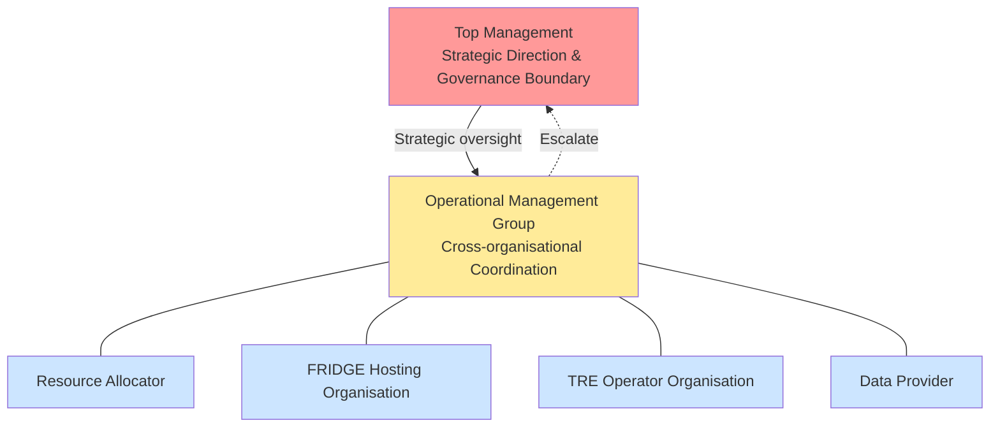

# Governing FRIDGE

**Version:** 1.0  
**Target Infrastructure:** UK AIRR (Dawn, Isambard-AI)  
**Compliance:** SATRE Specification, NHS DSP Toolkit

## 1. Overview

This document defines the governance structure for the FRIDGE (Federated Research Infrastructure by Data Governance Extension) federation. It establishes the hierarchical management framework and operational processes that ensure secure, compliant access to sensitive data on AI supercomputing resources.

### 1.1 Governance Structure Diagram

#### Diagram Legend:
- **Red box**: Top Management (strategic level)
- **Yellow box**: Operational Management Group (coordination level)
- **Light blue boxes**: Four member organisations
- **Solid lines**: Membership/reporting
- **Dotted line**: Escalation path

## 2. Governance Hierarchy

### 2.1 Top Management

**Accountability:** Overall governance boundary and strategic direction

**Scope:** The "Organisation" covered by top management includes the extended governance boundary spanning:
- Front Door TRE
- FRIDGE hosting platform
- All interconnected systems and data flows

**Responsibilities:**
- Define and maintain the governance boundary
- Approve shared responsibilities
- Approve governance framework and policies
- Oversee risk management across the federation

**Reference:** [SATRE Top Management Role](https://satre-specification.readthedocs.io/en/stable/roles.html#governance-roles)

---

### 2.2 Operational Management Group

**Purpose:** Coordinate day-to-day operations and ensure cross-organisational alignment

**Composition:** Representatives from all four key organisations:
1. Resource Allocator
2. FRIDGE Hosting Organisation
3. TRE Operator Organisation
4. Information Governance from Data provider and/or TRE Operator

**Responsibilities:**
- Agree shared responsibilities
- Review ongoing projects and operations
- Address cross-organisational issues
- Escalate strategic issues to Top Management
- Monitor security and performance across the federation
- Coordinate changes to the FRIDGE platform

**Reference:** [Safe Project Process - Section 4.1](FRIDGE_SAFE_Project_Process.md#41-operational-management-group)

---

## 3. Operational Management Group Members

### 3.1 Resource Allocator (Resource Owner)

**Organisational Role:** Manages AIRR resource allocation and strategic alignment

**Key Responsibilities:**
- Approve compute resource requests for Safe projects
- Ensure projects align with AIRR strategic objectives
- Manage allocation lifecycle and capacity planning
- Approve Safe Setting requests for new TRE Operators

**Process Involvement:**
- [Safe Project Process](FRIDGE_SAFE_Project_Process.md) - Resource allocation review and approval
- [Safe Setting Process](FRIDGE_Safe_Setting_Process.md) - Approve Safe Setting status

**Reference:** [Roles Catalogue](FRIDGE_Governance_Extension_Architecture.md#2-roles)

---

### 3.2 FRIDGE Hosting Organisation

**Organisational Role:** Provisions and secures resources on FRIDGE hosting facility (AIRR infrastructure)

**Key Responsibilities:**
- Provision compute resources on AIRR infrastructure (Dawn, Isambard-AI)
- Create and secure isolated project spaces
- Establish network isolation and security controls
- Monitor infrastructure security and performance
- Approve Safe Setting status for TRE Operators

**Accountable Boundaries:**
- [FRIDGE TRE Hosting Boundary](FRIDGE_Governance_Extension_Architecture.md#25-fridge-tre-hosting-boundary)
- [FRIDGE TRE Boundary](FRIDGE_Governance_Extension_Architecture.md#26-fridge-tre-boundary) (shared with TRE Operator)

**Process Involvement:**
- [Safe Project Process](FRIDGE_SAFE_Project_Process.md) - FRIDGE hosting platform provisioning
- [Safe Setting Process](FRIDGE_Safe_Setting_Process.md) - Review and approve Safe Setting requests

**Reference:** [Roles Catalogue](FRIDGE_Governance_Extension_Architecture.md#2-roles)

---

### 3.3 TRE Operator Organisation

**Organisational Role:** Operates Front Door TRE and FRIDGE TRE with technical security controls

**Key Responsibilities:**
- Operate Front Door TRE and FRIDGE TRE
- Implement technical security controls
- Manage infrastructure and network controls
- Provide study/project management processes
- Maintain SATRE compliance
- Verify approvals before provisioning researcher access
- Provision accounts and authentication credentials

**Accountable Boundaries:**
- [Front Door TRE Boundary](FRIDGE_Governance_Extension_Architecture.md#23-front-door-tre-boundary)
- [TRE Project Boundary](FRIDGE_Governance_Extension_Architecture.md#24-tre-project-boundary) (shared with Data Provider)
- [FRIDGE TRE Boundary](FRIDGE_Governance_Extension_Architecture.md#26-fridge-tre-boundary) (shared with FRIDGE Hosting)

**Process Involvement:**
- [Safe Setting Process](FRIDGE_Safe_Setting_Process.md) - Submit Safe Setting request and deploy test environment
- [Safe Project Process](FRIDGE_SAFE_Project_Process.md) - Provision TRE environments
- [Safe Researcher Process](FRIDGE_Safe_Researcher_Process.md) - Verify approvals and provision access

**Reference:** [Roles Catalogue](FRIDGE_Governance_Extension_Architecture.md#2-roles)

---

### 3.4 Data Provider 

**Organisational Role:** Data governance and information asset management

**Key Responsibilities:**
- Define data access requirements
- Approve data access requests for Safe projects
- Approve Safe researchers (or delegate to TRE Operator)
- Ensure data handling compliance
- Define data lifecycle and retention policies

**Accountable Boundaries:**
- [TRE Project Boundary](FRIDGE_Governance_Extension_Architecture.md#24-tre-project-boundary) (shared with TRE Operator)
- [Governance Boundary](FRIDGE_Governance_Extension_Architecture.md#21-governance-boundary) (established through Data Access Agreement)

**Process Involvement:**
- [Safe Project Process](FRIDGE_SAFE_Project_Process.md) - Review and approve project applications
- [Safe Researcher Process](FRIDGE_Safe_Researcher_Process.md) - Approve researchers and training

**Reference:** [Roles Catalogue](FRIDGE_Governance_Extension_Architecture.md#2-roles)

---

## 4. Governance Framework

As the governance for the front door TRE is extended into the FRIDGE hosting organisation, the security of the overall system may be affected by changes to the hosting organisation's environment. The Operational Management Group ensures that concerns from all organisations are considered and addressed.

### 4.1 Key Governance Principles

1. **Shared Responsibility:** Multiple organisations share accountability for different boundaries and controls
2. **Clear Escalation:** Issues escalate from operational level to Top Management as needed
3. **Continuous Monitoring:** All organisations continuously monitor their areas of responsibility
4. **Process-Driven:** Standardised processes (Safe Setting, Safe Project, Safe Researcher) ensure consistency
5. **Compliance Focus:** All activities maintain SATRE and NHS DSP Toolkit compliance

### 4.2 Decision-Making Authority

**Top Management:**
- Strategic decisions affecting governance boundary
- Major architectural changes
- Policy and framework approvals
- Risk acceptance decisions

**Operational Management Group:**
- Day-to-day operational decisions
- Cross-organisational coordination
- Process adaptations and improvements
- Incident response coordination

**Individual Organisations:**
- Decisions within their area of responsibility
- Technical implementation details
- Routine approvals (as defined in processes)

---

## 5. Establishing Governance

This section describes the process for setting up the FRIDGE governance structure.

### 5.1 Identify Organisational Sponsorship

Each key organisation identifies:
- Executive sponsor with accountability
- Operational Management Group representative
- Decision-making authority

### 5.2 Establish Risk Framework

Define risk management approach:
- **Risk Ownership:** Top Management (strategic), individual organisations (operational), Operational Management Group (shared)
- **Risk Assessment:** Identify risks, assess impact, define risk appetite
- **Risk Controls:** Map controls to boundaries, establish monitoring and incident response

### 5.3 Form Governance Groups

**Top Management:**
- Identify senior representatives from each organisation
- Define governance boundary scope and charter
- Approve governance framework and risk approach

**Operational Management Group:**
- Nominate operational representatives from each organisation
- Define terms of reference and decision-making authority
- Document shared responsibility matrix and escalation procedures

**Reference:** See [Implementation Guide - Phase 1](FRIDGE_Implementation_Guide.md#phase-1-establish-governance-structure) for detailed implementation steps.

---

