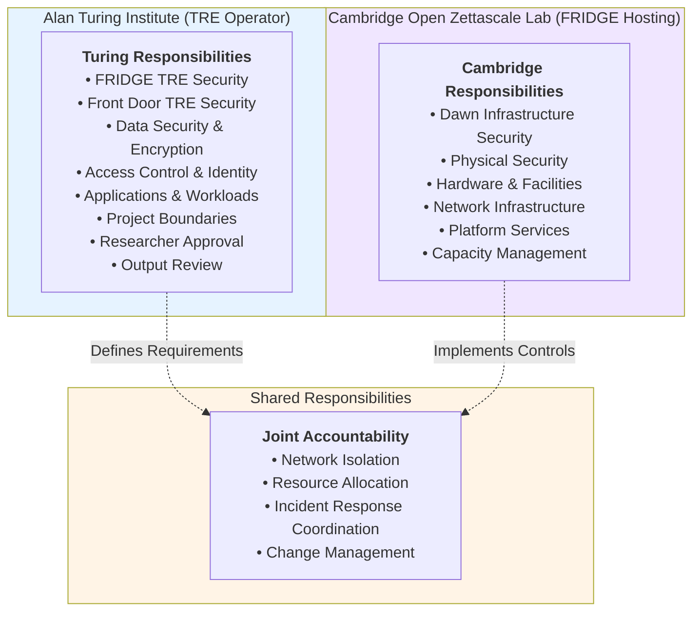

# Shared Responsibility Model: Turing-Dawn-FRIDGE

**TRE Operator Organisation:** The Alan Turing Institute  
**FRIDGE Hosting Organisation:** Cambridge Open Zettascale Lab  
**FRIDGE Instance:** Turing-Dawn-FRIDGE  
**Version:** 1.0  
**Compliance:** SATRE Specification, NHS DSP Toolkit

## 1. Overview

This document defines the shared responsibility model between The Alan Turing Institute (TRE Operator Organisation) and Cambridge Open Zettascale Lab (FRIDGE Hosting Organisation) for the Turing-Dawn-FRIDGE instance. This model follows the approach used by major cloud providers (AWS, Azure, GCP) where responsibilities are clearly delineated between the infrastructure provider and the customer.

### 1.1 Key Principle

**The Alan Turing Institute retains full accountability for the security of the Turing-Dawn-FRIDGE infrastructure and all user data.** Cambridge Open Zettascale Lab is accountable for the security of the Dawn supercomputer. Where processes, applications, data or infrastructure are shared responsibilities are defined in more detail.

### 1.2 Shared Responsibility Diagram

## 2. Responsibility Matrix

### 2.1 Alan Turing Institute Responsibilities

The Alan Turing Institute, as TRE Operator Organisation, is accountable for:

| Area | Specific Responsibilities | Reference |
|------|--------------------------|-----------|
| **FRIDGE TRE Security** | • Deploy and configure FRIDGE TRE • Implement technical security controls • Manage TRE software and updates • Configure job processing systems • Maintain SATRE compliance | [FRIDGE TRE Boundary](../FRIDGE_Governance_Extension_Architecture.md#36-fridge-tre-boundary) |
| **Front Door TRE Security** | • Operate Front Door TRE • Implement infrastructure management • Manage study/project processes • Maintain TRE capabilities | [Front Door TRE Boundary](../FRIDGE_Governance_Extension_Architecture.md#33-front-door-tre-boundary) |
| **Data Security** | • Encrypt data at rest and in transit • Manage encryption keys • Control data lifecycle • Implement data handling policies • Ensure data isolation between projects | [TRE Project Boundary](../FRIDGE_Governance_Extension_Architecture.md#34-tre-project-boundary) |
| **Access Control & Identity** | • Manage user accounts and authentication • Implement role-based access control • Provision researcher access • Verify approvals before access • Manage credentials and tokens | [Safe Researcher Process](../FRIDGE_Safe_Researcher_Process.md) |
| **Applications & Workloads** | • Deploy and manage applications • Configure job submission systems • Implement output review processes • Manage software dependencies | [Safe Project Process](../FRIDGE_SAFE_Project_Process.md) |
| **Project Boundaries** | • Establish project workspaces • Implement project isolation • Manage project lifecycle • Coordinate with Data Providers | [TRE Project Boundary](../FRIDGE_Governance_Extension_Architecture.md#34-tre-project-boundary) |
| **Governance & Compliance** | • Maintain SATRE compliance • Implement information governance • Conduct output reviews • Manage researcher training • Maintain audit trails | [Governing FRIDGE](../Governing_FRIDGE.md) |

### 2.2 Cambridge Open Zettascale Lab Responsibilities

Cambridge Open Zettascale Lab, as FRIDGE Hosting Organisation, is accountable for:

| Area | Specific Responsibilities | Reference |
|------|--------------------------|-----------|
| **Dawn Infrastructure Security** | • Secure Dawn supercomputer platform • Maintain platform security controls • Monitor infrastructure security • Implement platform hardening • Manage platform vulnerabilities | [FRIDGE TRE Hosting Boundary](../FRIDGE_Governance_Extension_Architecture.md#35-fridge-tre-hosting-boundary) |
| **Physical Security** | • Secure data centre facilities • Control physical access • Maintain environmental controls • Implement physical monitoring • Manage facility incidents | [FRIDGE TRE Hosting Boundary](../FRIDGE_Governance_Extension_Architecture.md#35-fridge-tre-hosting-boundary) |
| **Hardware & Facilities** | • Maintain compute hardware • Manage storage systems • Ensure hardware reliability • Implement hardware lifecycle • Manage hardware failures | [FRIDGE TRE Hosting Boundary](../FRIDGE_Governance_Extension_Architecture.md#35-fridge-tre-hosting-boundary) |
| **Network Infrastructure** | • Provide network connectivity • Maintain network hardware • Implement base network security • Monitor network performance • Manage network incidents | [FRIDGE TRE Hosting Boundary](../FRIDGE_Governance_Extension_Architecture.md#35-fridge-tre-hosting-boundary) |
| **Platform Services** | • Operate Dawn platform services • Maintain service availability • Implement platform monitoring • Manage platform updates • Provide platform support | [FRIDGE TRE Hosting Boundary](../FRIDGE_Governance_Extension_Architecture.md#35-fridge-tre-hosting-boundary) |
| **Capacity Management** | • Manage compute capacity • Monitor resource utilisation • Plan capacity expansion • Allocate resources per agreements • Report on capacity | [Safe Project Process](../FRIDGE_SAFE_Project_Process.md) |

### 2.3 Shared Responsibilities

The following responsibilities require coordination and joint accountability between both organisations:

| Area | Turing Responsibilities | Cambridge Responsibilities | Coordination Mechanism |
|------|------------------------|---------------------------|------------------------|
| **Network Isolation** | • Define network isolation requirements • Specify security policies • Configure TRE network controls • Monitor TRE network traffic | • Implement network segmentation • Configure platform network policies • Enforce isolation at infrastructure level • Monitor platform network security | Operational Management Group reviews network architecture and approves changes |
| **Resource Allocation** | • Define resource requirements • Request resource allocation • Monitor resource usage • Manage project resources | • Provision allocated resources • Implement resource quotas • Monitor platform capacity • Report resource availability | Resource Allocator coordinates allocation decisions with both parties |
| **Incident Response** | • Detect and respond to TRE incidents • Investigate security events • Implement remediation • Report incidents per agreements | • Detect and respond to platform incidents • Investigate infrastructure events • Implement platform remediation • Report incidents per agreements | Joint incident response procedures with defined escalation paths |
| **Change Management** | • Plan TRE changes • Assess change impact • Implement TRE changes • Validate TRE functionality | • Plan platform changes • Assess platform impact • Implement platform changes • Communicate platform changes | Operational Management Group coordinates changes affecting both parties |

## 3. Boundary Accountability

### 3.1 Governance Boundary

**Accountable:** Top Management (joint oversight from both organisations)

**Scope:** The governance boundary encompasses the entire Turing-Dawn-FRIDGE system including Front Door TRE, FRIDGE TRE on Dawn, and all interconnected systems.

**Established by:** [Safe Setting Process](../FRIDGE_Safe_Setting_Process.md) when agreement is formed between organisations.

### 3.2 Front Door TRE Hosting Boundary

**Accountable:** The Alan Turing Institute (or their cloud provider)

**Scope:** Security of the underlying infrastructure hosting the Front Door TRE.

**Reference:** [Front Door TRE Hosting Boundary](../FRIDGE_Governance_Extension_Architecture.md#32-front-door-tre-hosting-boundary)

### 3.3 Front Door TRE Boundary

**Accountable:** The Alan Turing Institute

**Scope:** Security of the Front Door TRE including technical controls and process controls.

**Reference:** [Front Door TRE Boundary](../FRIDGE_Governance_Extension_Architecture.md#33-front-door-tre-boundary)

### 3.4 TRE Project Boundary

**Accountable:** The Alan Turing Institute (shared with Data Provider)

**Scope:** Security of individual project workspaces including data access controls and project-specific security measures.

**Reference:** [TRE Project Boundary](../FRIDGE_Governance_Extension_Architecture.md#34-tre-project-boundary)

### 3.5 FRIDGE TRE Hosting Boundary

**Accountable:** Cambridge Open Zettascale Lab

**Scope:** Security of the Dawn supercomputer platform including hardware, software, networking, and facilities.

**Reference:** [FRIDGE TRE Hosting Boundary](../FRIDGE_Governance_Extension_Architecture.md#35-fridge-tre-hosting-boundary)

### 3.6 FRIDGE TRE Boundary

**Accountable:** The Alan Turing Institute (shared with Cambridge Open Zettascale Lab)

**Scope:** Security of the Turing-Dawn-FRIDGE TRE deployed on Dawn, including:
- **Turing:** Data, applications, encryption, identity, access control
- **Cambridge:** Network isolation implementation, resource provisioning
- **Shared:** Network policies, resource allocation, change coordination

**Reference:** [FRIDGE TRE Boundary](../FRIDGE_Governance_Extension_Architecture.md#36-fridge-tre-boundary)

## 4. Operational Coordination

### 4.1 Operational Management Group

Representatives from both organisations participate in the Operational Management Group to:
- Review shared responsibility implementation
- Coordinate operational activities
- Address cross-organisational issues
- Escalate strategic issues to Top Management

**Reference:** [Operational Management Group](../Governing_FRIDGE.md#22-operational-management-group)

### 4.2 Communication Channels

| Purpose | Mechanism | Frequency |
|---------|-----------|-----------|
| Strategic oversight | Top Management meetings | As required |
| Operational coordination | Operational Management Group | Regular schedule |
| Incident response | 24/7 contact procedures | As needed |
| Change management | Change advisory process | Per change schedule |
| Performance review | Service review meetings | Quarterly |

### 4.3 Escalation Paths

1. **Operational Issues:** Raised within Operational Management Group
2. **Cross-boundary Issues:** Coordinated through Operational Management Group
3. **Strategic Issues:** Escalated to Top Management
4. **Security Incidents:** Follow joint incident response procedures

## 5. Compliance and Assurance

### 5.1 Turing Compliance Obligations

The Alan Turing Institute maintains:
- SATRE specification compliance for TRE operations
- NHS DSP Toolkit compliance (if handling NHS data)
- Information governance framework
- Audit trails and evidence
- Regular compliance reviews

### 5.2 Cambridge Compliance Obligations

Cambridge Open Zettascale Lab maintains:
- Infrastructure security standards
- Physical security certifications
- Platform security controls
- Infrastructure audit trails
- Regular security assessments

### 5.3 Joint Assurance Activities

- Annual security audits covering shared boundaries
- Penetration testing of FRIDGE TRE deployment
- Compliance reviews by Operational Management Group
- Incident response exercises
- Business continuity testing

**Reference:** [Safe Setting Process](../FRIDGE_Safe_Setting_Process.md) for initial audit and penetration testing requirements.

## 6. Risk Management

### 6.1 Risk Ownership

| Risk Category | Primary Owner | Supporting Owner |
|---------------|---------------|------------------|
| Data breach from TRE | Turing | Cambridge (infrastructure controls) |
| Platform security incident | Cambridge | Turing (TRE impact assessment) |
| Unauthorised access | Turing | Cambridge (network controls) |
| Infrastructure failure | Cambridge | Turing (business continuity) |
| Compliance violation | Turing | Cambridge (supporting evidence) |
| Researcher misconduct | Turing | Cambridge (audit support) |

### 6.2 Residual Risk

The Alan Turing Institute accepts residual risk from:
- Cambridge Open Zettascale Lab's operation of Dawn infrastructure
- Shared components outside the governance boundary
- Dependencies on platform services

These risks are managed through:
- Additional TRE-level controls (encryption, network policies)
- Continuous monitoring and audit
- Operational Management Group oversight
- Regular risk reviews

**Reference:** [FRIDGE TRE Boundary](../FRIDGE_Governance_Extension_Architecture.md#36-fridge-tre-boundary)

## 7. Service Level Expectations

### 7.1 Turing Service Commitments

- Maintain Turing-Dawn-FRIDGE TRE availability per agreed service levels
- Respond to researcher support requests
- Process output reviews within defined timeframes
- Provision researcher access per Safe Researcher Process
- Maintain security controls and monitoring

### 7.2 Cambridge Service Commitments

- Maintain Dawn platform availability per agreed service levels
- Provision allocated resources within defined timeframes
- Respond to infrastructure incidents
- Provide advance notice of planned maintenance
- Support incident investigations

### 7.3 Joint Service Commitments

- Coordinate maintenance windows
- Minimise service disruptions
- Communicate service impacts
- Conduct regular service reviews
- Continuously improve service delivery

## 8. Review and Updates

This shared responsibility model will be reviewed:
- Annually by the Operational Management Group
- Following significant changes to either organisation's infrastructure
- Following security incidents affecting shared boundaries
- When new Turing-Dawn-FRIDGE capabilities are deployed
- As required by Top Management

**Document Owner:** Operational Management Group  
**Approval Authority:** Top Management  
**Next Review Date:** [To be determined upon implementation]

---

## Related Documents

- [FRIDGE Governance Extension Architecture](../FRIDGE_Governance_Extension_Architecture.md)
- [Governing FRIDGE](../Governing_FRIDGE.md)
- [Safe Setting Process](../FRIDGE_Safe_Setting_Process.md)
- [Safe Project Process](../FRIDGE_SAFE_Project_Process.md)
- [Safe Researcher Process](../FRIDGE_Safe_Researcher_Process.md)
- [FRIDGE Implementation Guide](../FRIDGE_Implementation_Guide.md)
