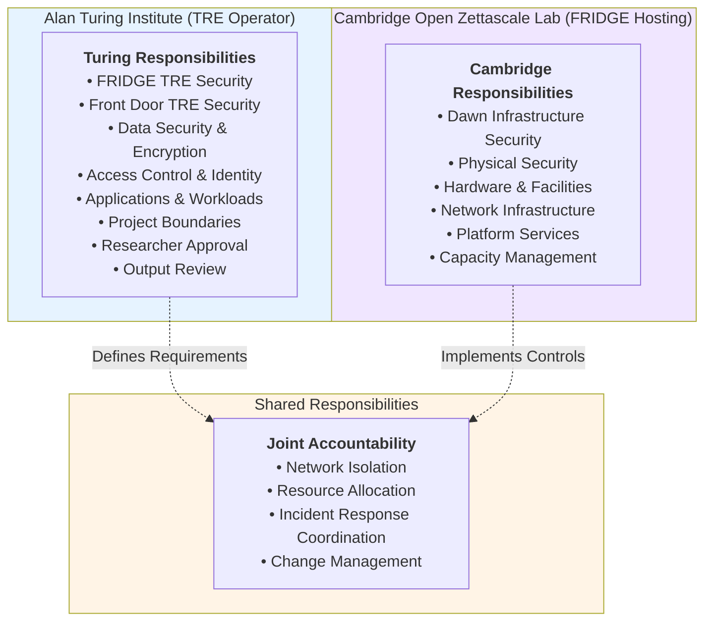

# Shared Responsibility Model: Turing-Dawn-FRIDGE

**TRE Operator Organisation:** The Alan Turing Institute  
**FRIDGE Hosting Organisation:** Cambridge Open Zettascale Lab  
**FRIDGE Instance:** Turing-Dawn-FRIDGE  
**Version:** 1.0  
**Compliance:** SATRE Specification, NHS DSP Toolkit

## 1. Overview

This document defines the shared responsibility model between The Alan Turing Institute (TRE Operator Organisation) and Cambridge Open Zettascale Lab (FRIDGE Hosting Organisation) for the Turing-Dawn-FRIDGE instance. This model follows the approach used by major cloud providers (AWS, Azure, GCP) where responsibilities are clearly delineated between the infrastructure provider and the customer.

### 1.1 Key Principle

**The Alan Turing Institute retains full accountability for the security of the Turing-Dawn-FRIDGE infrastructure and all user data.** Cambridge Open Zettascale Lab is accountable for the security of the Dawn supercomputer. Where processes, applications, data or infrastructure are shared responsibilities are defined in more detail.

### 1.2 Shared Responsibility Diagram

## 2. Responsibility Matrix

### 2.1 Alan Turing Institute Responsibilities

The Alan Turing Institute, as TRE Operator Organisation, is accountable for:

| Area | Specific Responsibilities | DSPT Ref  | Reference |
|------|--------------------------|-----------|------------|
| **FRIDGE TRE Security** | • Deploy and configure FRIDGE TRE • Implement technical security controls • Manage TRE software and updates • Configure job processing systems • Maintain SATRE compliance | • 8.1.4, 8.3.5, 8.4.1, 9.5.3   • 8.4.1, 8.4.2, 9.1.1, 9.6.1, 9.4.4   • 8.1.4, 8.2.1, 8.3.2, 8.3.5, 8.4.2, 9.2.1, 9.2.3   • 9.5.3, 9.5.1, 8.4.1, 8.4.2, 9.1.1, 9.6.1   • 4.5.3, 4.4.1, 8.4.1, 8.3.5, 9.2.1, 7.1.2, 7.3.1, 10.2.1 | [FRIDGE TRE Boundary](../FRIDGE_Governance_Extension_Architecture.md#36-fridge-tre-boundary) |
| **Front Door TRE Security** | • Operate Front Door TRE • Implement infrastructure management • Manage study/project processes • Maintain TRE capabilities | • 4.2.4, 4.3.1, 4.5.3, 9.6.1, 9.1.1, 8.4.1   • 8.4.1, 8.4.2, 9.5.1, 9.5.3, 9.1.1, 9.6.1   • 1.3.7, 1.3.8, 4.1.1, 4.2.4, 6.1.1   • 4.5.3, 4.4.1, 8.1.4, 8.3.5, 8.4.1, 9.6.1, 10.2.1 | [Front Door TRE Boundary](../FRIDGE_Governance_Extension_Architecture.md#33-front-door-tre-boundary) |
| **Data Security** | • Encrypt data at rest and in transit • Manage encryption keys • Control data lifecycle • Implement data handling policies • Ensure data isolation between projects | • 9.3.6, 9.5.2, 8.4.1   • 4.3.1, 4.4.1, 8.3.5, 8.4.1, 9.3.6   • 1.4.1, 1.4.3, 1.3.7, 1.1.2   • 1.3.1, 1.3.7, 1.3.8, 1.4.1, 1.4.3    • 44.1.1, 4.2.4, 9.6.1, 9.5.3, 8.4.1, 1.3.7 |[TRE Project Boundary](../FRIDGE_Governance_Extension_Architecture.md#34-tre-project-boundary) |
| **Access Control & Identity** | • Manage user accounts and authentication • Implement role-based access control • Provision researcher access • Verify approvals before access • Manage credentials and tokens | • 4.1.1, 4.2.4, 4.5.3, 4.5.4, 4.3.1, 4.4.1   • 4.1.1, 4.2.4, 4.3.1, 4.5.3, 1.3.7   • 4.1.1, 4.2.4, 4.5.3, 4.3.1, 1.3.7   • 4.1.1, 4.2.4, 4.3.1, 4.4.1, 1.3.7   • 4.5.3, 4.5.4, 4.3.1, 4.4.1, 9.5.1, 8.3.5 | [Safe Researcher Process](../FRIDGE_Safe_Researcher_Process.md) |
| **Applications & Workloads** | • Deploy and manage applications • Configure job submission systems • Implement output review processes • Manage software dependencies | • 9.5.1, 9.5.3, 8.3.5, 8.1.4, 9.2.1, 9.4.4   • 9.5.3, 9.5.1, 8.4.1, 8.4.2, 9.1.1, 9.6.1   • 8.1.4, 8.2.1, 8.3.5, 9.5.3, 9.5.1, 9.4.4   • 1.3.7, 1.1.2, 4.4.1, 6.1.1, 9.3.6, 10.2.2 | [Safe Project Process](../FRIDGE_SAFE_Project_Process.md) |
| **Project Boundaries** | • Establish project workspaces • Implement project isolation • Manage project lifecycle • Coordinate with Data Providers | • 1.3.7, 1.3.8, 4.1.1, 9.5.3, 9.6.1, 8.4.1   • 4.1.1, 4.2.4, 9.5.1, 9.6.1, 9.3.5, 1.3.7   • 1.1.2, 1.3.7, 4.2.4, 4.4.1, 9.5.3, 1.4.1, 1.4.3   • 1.1.2, 10.1.2, 10.2.2, 10.2.5, 1.2.4, 9.3.6 | [TRE Project Boundary](../FRIDGE_Governance_Extension_Architecture.md#34-tre-project-boundary) |
| **Governance & Compliance** | • Maintain SATRE compliance • Implement information governance • Conduct output reviews • Manage researcher training • Maintain audit trails | • 4.5.3, 4.4.1, 8.4.1, 8.3.5, 9.2.1, 7.1.2, 10.2.1   • 1.1.2, 1.1.5, 1.3.1, 1.3.2, 1.3.6, 1.4.1, 6.1.1, 10.2.2   • 2.1.1, 3.1.1, 3.2.1, 3.3.1, 3.4.1   • 1.3.7, 1.1.2, 4.4.1, 6.1.1, 9.3.6, 10.2.2   • 4.4.1, 4.3.3, 6.1.1, 6.3.5, 9.5.3, 9.6.1, 1.4.3, 10.2.2 | [Governing FRIDGE](../Governing_FRIDGE.md) |

[DSPT Controls reference file]("./Images/DSPT controls.xlsx")

### 2.2 Cambridge Open Zettascale Lab Responsibilities

Cambridge Open Zettascale Lab, as FRIDGE Hosting Organisation, is accountable for:

| Area | Specific Responsibilities | DSPT Ref | Reference |
|------|--------------------------|----------|-----------|
| **Dawn Infrastructure Security** | • Secure Dawn supercomputer platform • Maintain platform security controls • Monitor infrastructure security • Implement platform hardening • Manage platform vulnerabilities | • 8.4.1, 8.4.2, 8.3.5   • 9.5.1, 8.1.4, 9.4.4   • 6.1.1, 6.3.1, 6.3.5   • 8.4.1, 9.1.1, 9.6.1   • 8.4.3, 9.2.1, 9.2.3, 9.4.4 | [FRIDGE TRE Hosting Boundary](../FRIDGE_Governance_Extension_Architecture.md#35-fridge-tre-hosting-boundary) |
| **Physical Security** | • Secure data centre facilities • Control physical access • Maintain environmental controls • Implement physical monitoring • Manage facility incidents | • 1.3.13   • 1.3.13   • 7.1.1   • 1.3.13   • 6.1.1, 6.1.2 | [FRIDGE TRE Hosting Boundary](../FRIDGE_Governance_Extension_Architecture.md#35-fridge-tre-hosting-boundary) |
| **Hardware & Facilities** | • Maintain compute hardware • Manage storage systems • Ensure hardware reliability • Implement hardware lifecycle • Manage hardware failures | • 8.1.4, 8.4.2   • 7.3.1, 7.3.4   • 7.1.1, 7.2.1   • 1.4.3   • 7.1.2, 7.2.1 | [FRIDGE TRE Hosting Boundary](../FRIDGE_Governance_Extension_Architecture.md#35-fridge-tre-hosting-boundary) |
| **Network Infrastructure** | • Provide network connectivity • Maintain network hardware • Implement base network security • Monitor network performance • Manage network incidents | • 9.1.1, 9.6.1   • 9.1.1, 8.4.2   • 9.6.1, 9.3.5   • 6.3.1   • 6.1.1, 6.1.2 | [FRIDGE TRE Hosting Boundary](../FRIDGE_Governance_Extension_Architecture.md#35-fridge-tre-hosting-boundary) |
| **Platform Services** | • Operate Dawn platform services • Maintain service availability • Implement platform monitoring • Manage platform updates • Provide platform support | • 8.4.1, 8.3.5   • 7.1.1, 7.1.2   • 6.1.1, 6.3.5   • 8.3.5, 8.1.4, 9.4.4   • 10.1.2, 10.2.1 | [FRIDGE TRE Hosting Boundary](../FRIDGE_Governance_Extension_Architecture.md#35-fridge-tre-hosting-boundary) |
| **Capacity Management** | • Manage compute capacity • Monitor resource utilisation • Plan capacity expansion • Allocate resources per agreements • Report on capacity | • 7.1.1   • 6.3.5   • 7.1.1, 7.2.1   • 4.1.1, 4.2.4   • 7.1.1, 5.2.1 | [Safe Project Process](../FRIDGE_SAFE_Project_Process.md) |

### 2.3 Shared Responsibilities

The following responsibilities require coordination and joint accountability between both organisations:

| Area | Turing Responsibilities | Cambridge Responsibilities | Coordination Mechanism |
|------|------------------------|---------------------------|------------------------|
| **Network Isolation** | • Define network isolation requirements • Specify security policies • Configure TRE network controls • Monitor TRE network traffic | • Implement network segmentation • Configure platform network policies • Enforce isolation at infrastructure level • Monitor platform network security | Operational Management Group reviews network architecture and approves changes |
| **Resource Allocation** | • Define resource requirements • Request resource allocation • Monitor resource usage • Manage project resources | • Provision allocated resources • Implement resource quotas • Monitor platform capacity • Report resource availability | Resource Allocator coordinates allocation decisions with both parties |
| **Incident Response** | • Detect and respond to TRE incidents • Investigate security events • Implement remediation • Report incidents per agreements | • Detect and respond to platform incidents • Investigate infrastructure events • Implement platform remediation • Report incidents per agreements | Joint incident response procedures with defined escalation paths |
| **Change Management** | • Plan TRE changes • Assess change impact • Implement TRE changes • Validate TRE functionality | • Plan platform changes • Assess platform impact • Implement platform changes • Communicate platform changes | Operational Management Group coordinates changes affecting both parties |

## 3. Boundary Accountability

### 3.1 Governance Boundary

**Accountable:** Top Management (joint oversight from both organisations)

**Scope:** The governance boundary encompasses the entire Turing-Dawn-FRIDGE system including Front Door TRE, FRIDGE TRE on Dawn, and all interconnected systems.

